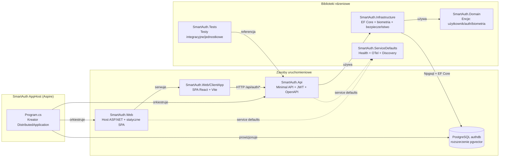

# Architektura (Mermaid)

```mermaid
flowchart LR
    subgraph Aspire["SmartAuth AppHost (Aspire)"]
        AppHost["Program.cs\nKreator DistributedApplication"]
    end

    subgraph Runtime["Zasoby uruchomieniowe"]
        Web["SmartAuth.Web\nHost ASP.NET + statyczne SPA"]
        SPA["SmartAuth.Web/ClientApp\nSPA React + Vite"]
        Api["SmartAuth.Api\nMinimal API + JWT + OpenAPI"]
        Db[("PostgreSQL authdb\nrozszerzenie pgvector")]
    end

    subgraph Core["Biblioteki rdzeniowe"]
        Infra["SmartAuth.Infrastructure\nEF Core + biometria + bezpieczeństwo"]
        Domain["SmartAuth.Domain\nEncje: użytkownik/auth/biometria"]
        Defaults["SmartAuth.ServiceDefaults\nHealth + OTel + Discovery"]
        Tests["SmartAuth.Tests\nTesty integracyjne/jednostkowe"]
    end

    AppHost -->|orkiestruje| Web
    AppHost -->|orkiestruje| Api
    AppHost -->|prowizjonuje| Db

    Web -->|serwuje| SPA
    SPA -->|HTTP /api/auth/*| Api
    Web -. service defaults .-> Defaults
    Api -. service defaults .-> Defaults

    Api -->|używa| Infra
    Infra -->|używa| Domain
    Infra -->|Npgsql + EF Core| Db

    Tests -->|referencja| Api
```
