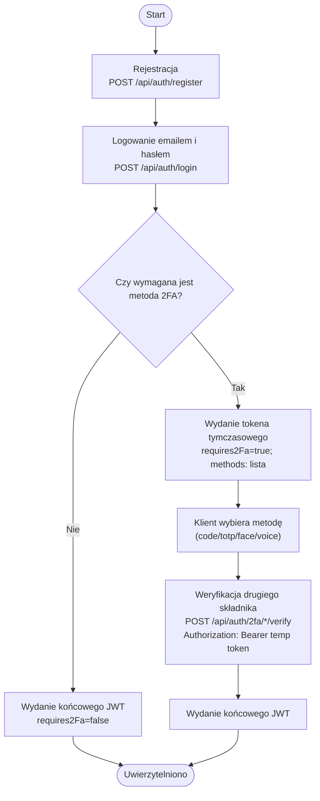

# Przepływ uwierzytelniania (Mermaid)

```mermaid
flowchart TD
    start([Start]) --> register["Rejestracja<br/>POST /api/auth/register"]
    register --> login["Logowanie emailem i hasłem<br/>POST /api/auth/login"]

    login --> requires2fa{"Czy wymagana jest metoda 2FA?"}

    requires2fa -- "Nie" --> finalJwt["Wydanie końcowego JWT<br/>requires2Fa=false"]
    finalJwt --> done([Uwierzytelniono])

    requires2fa -- "Tak" --> tempJwt["Wydanie tokena tymczasowego<br/>requires2Fa=true; methods: lista"]
    tempJwt --> pickMethod["Klient wybiera metodę<br/>(code/totp/face/voice)"]

    pickMethod --> verify2fa["Weryfikacja drugiego składnika<br/>POST /api/auth/2fa/*/verify<br/>Authorization: Bearer temp token"]
    verify2fa --> final2["Wydanie końcowego JWT"]
    final2 --> done
```
