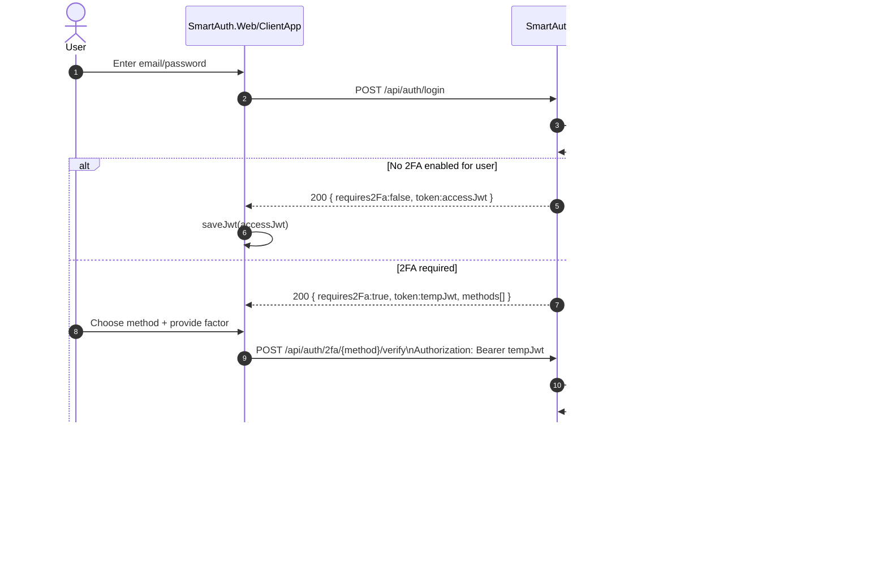

# Login + 2FA Sequence (Mermaid)

```mermaid
sequenceDiagram
    autonumber
    actor User
    participant SPA as SmartAuth.Web/ClientApp
    participant API as SmartAuth.Api
    participant DB as authdb (PostgreSQL + pgvector)

    User->>SPA: Enter email/password
    SPA->>API: POST /api/auth/login
    API->>DB: Load User + Authenticators + Biometrics
    DB-->>API: User aggregate

    alt No 2FA enabled for user
        API-->>SPA: 200 { requires2Fa:false, token:accessJwt }
        SPA->>SPA: saveJwt(accessJwt)
    else 2FA required
        API-->>SPA: 200 { requires2Fa:true, token:tempJwt, methods[] }
        User->>SPA: Choose method + provide factor
        SPA->>API: POST /api/auth/2fa/{method}/verify\nAuthorization: Bearer tempJwt
        API->>DB: Validate method data (TOTP/code/face/voice)
        DB-->>API: Validation context / biometric refs
        API-->>SPA: 200 { jwt: accessJwt }
        SPA->>SPA: saveJwt(accessJwt)
    end
```
