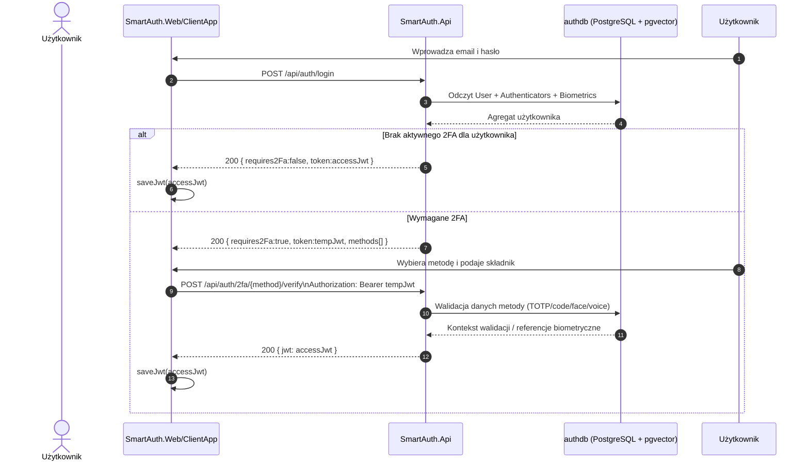

# Sekwencja logowania + 2FA (Mermaid)

```mermaid
sequenceDiagram
    autonumber
    actor User as Użytkownik
    participant SPA as SmartAuth.Web/ClientApp
    participant API as SmartAuth.Api
    participant DB as authdb (PostgreSQL + pgvector)

    Użytkownik->>SPA: Wprowadza email i hasło
    SPA->>API: POST /api/auth/login
    API->>DB: Odczyt User + Authenticators + Biometrics
    DB-->>API: Agregat użytkownika

    alt Brak aktywnego 2FA dla użytkownika
        API-->>SPA: 200 { requires2Fa:false, token:accessJwt }
        SPA->>SPA: saveJwt(accessJwt)
    else Wymagane 2FA
        API-->>SPA: 200 { requires2Fa:true, token:tempJwt, methods[] }
        Użytkownik->>SPA: Wybiera metodę i podaje składnik
        SPA->>API: POST /api/auth/2fa/{method}/verify\nAuthorization: Bearer tempJwt
        API->>DB: Walidacja danych metody (TOTP/code/face/voice)
        DB-->>API: Kontekst walidacji / referencje biometryczne
        API-->>SPA: 200 { jwt: accessJwt }
        SPA->>SPA: saveJwt(accessJwt)
    end
```
